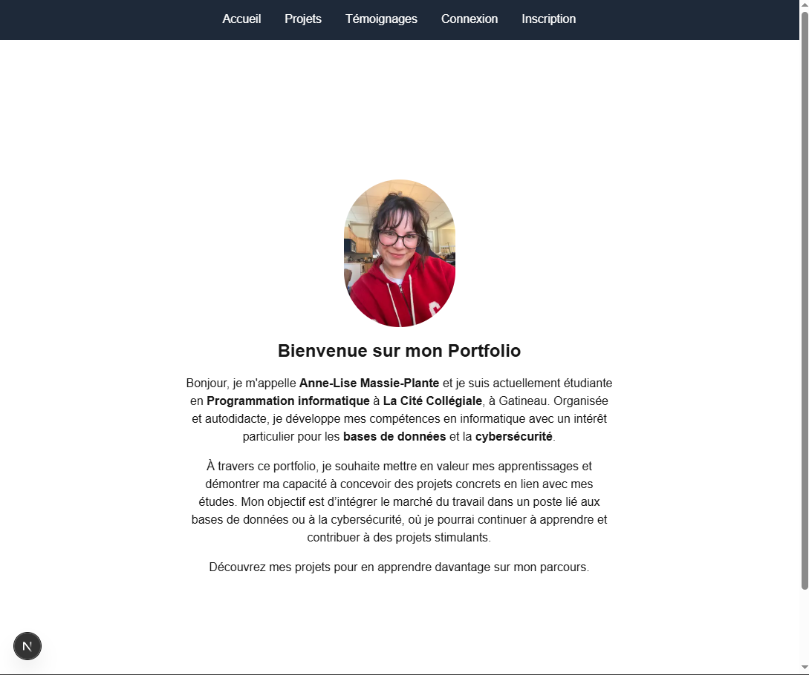
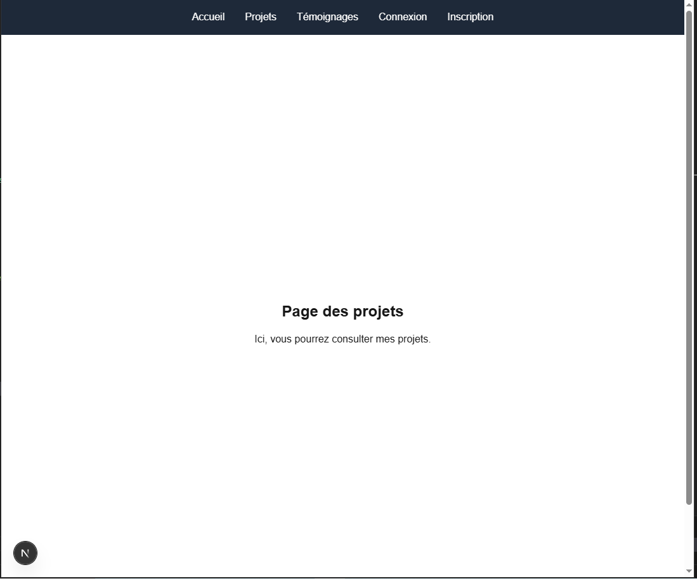
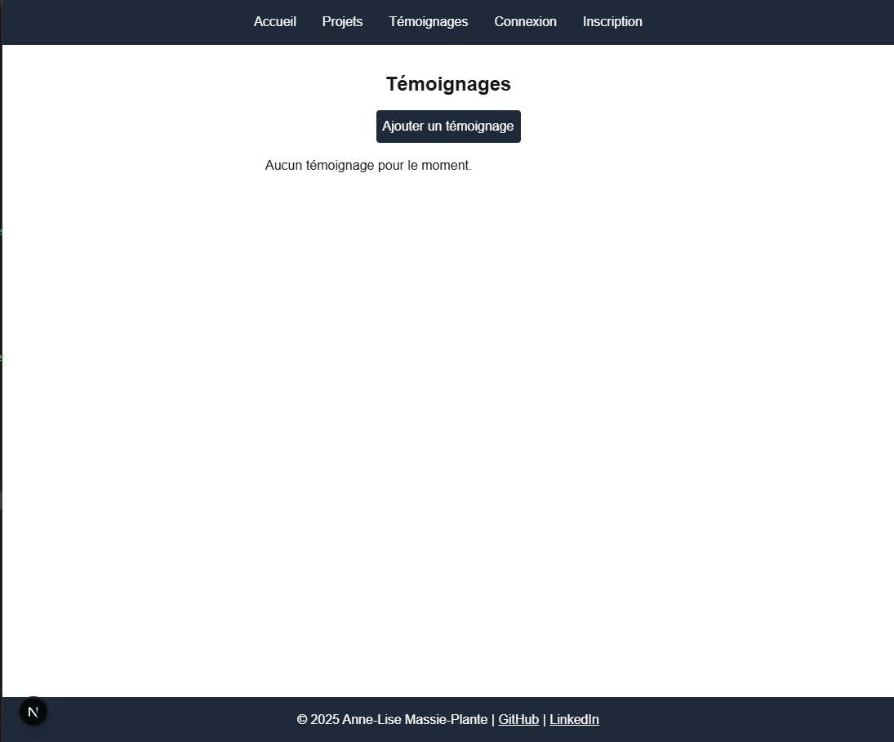

# Portfolio - Anne-Lise Massie-Plante

Bienvenue sur mon portfolio réalisé dans le cadre du cours **Programmation Web Avancé**.

## Liens

- **Portfolio en ligne** : [portfolio-anne-lise-mp.vercel.app](https://portfolio-anne-lise-mp.vercel.app)
- **Dépôt GitHub** : [https://github.com/Anne-Lise9/Portfolio-AnneLiseMP](https://github.com/Anne-Lise9/Portfolio-AnneLiseMP)

## Fonctionnalités

- Authentification (Inscription et Connexion)
- Validation des formulaires avec messages d’erreur
- Ajout et affichage de témoignages
- Protection des pages (accessible seulement si connecté)
- Gestion des états avec **Redux Toolkit**
- Design simple et épuré avec Tailwind CSS

## Captures d’écran

### Page d'accueil

### Page des projets

### Page des témoignages

## Réalisé par

**Anne-Lise Massie-Plante**  
Mars 2025
